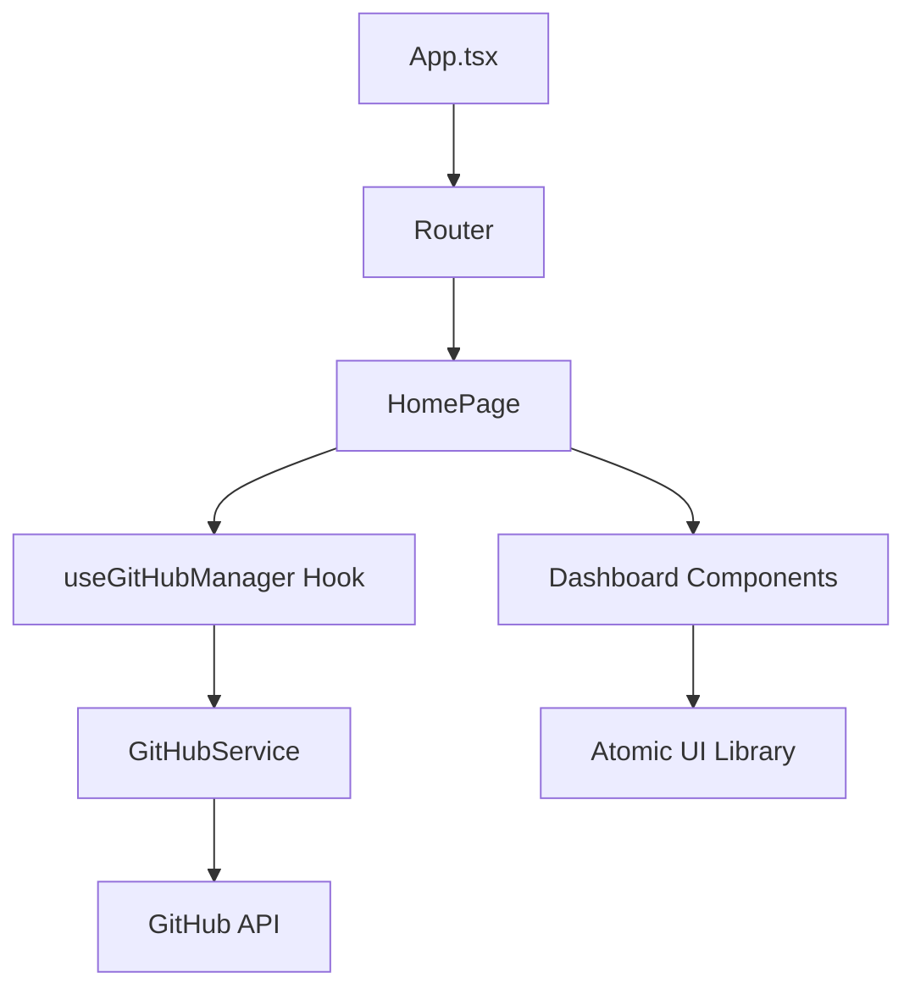

# 🚀 GitHub Follow Manager

[](https://reactjs.org/)
[](https://www.typescriptlang.org/)
[](https://vitejs.dev/)
[](LICENSE)

**GitHub Follow Manager** is a professional, high-performance tool I built to help developers manage their social connections on GitHub. It lets you analyze your followers, find who isn't following you back, and clean up your network with a sleek, automated dashboard.

## ✨ Features

- ⚡ **Lightning Fast**: Built with Vite 6 and React 18 for instant analysis.
- 💎 **Premium UI**: A clean, monochrome design with smooth animations.
- 🛡️ **Privacy First**: Everything runs right in your browser. Your tokens stay on your machine and never touch a private server.
- 📊 **Deep Insights**: See full profiles, repo counts, and account age without leaving the app.
- 📦 **Bulk Actions**: Unfollow non-mutuals or follow back fans in one click.
- 🚦 **Rate Limit Savvy**: Real-time monitoring keeps you within GitHub's API limits.

## 🚀 Quick Start

### Installation

```bash
# Clone the repository
git clone https://github.com/ArshVermaGit/github-nonfollowers-cleaner.git

# Enter the project
cd github-nonfollowers-cleaner

# Install dependencies
npm install

# Start development server
npm run dev
```

### Usage

1. Grab a **GitHub Personal Access Token (Classic)**.
2. Make sure it has `read:user` and `user:follow` permissions.
3. Paste the token and your username into the app.
4. Hit **Fetch & Analyze**.

## 🏗️ Architecture

The project is built with a focus on clean, modular code:



## 🤝 Contributing

I love seeing the community get involved. If you have an idea for a feature or find a bug, feel free to open a PR or an issue. Check out [CONTRIBUTING.md](CONTRIBUTING.md) to see how to get started.

## 📄 License

This project is licensed under the MIT License. See `LICENSE` for details.

---

Built with ❤️ by [Arsh Verma](https://github.com/ArshVermaGit)
