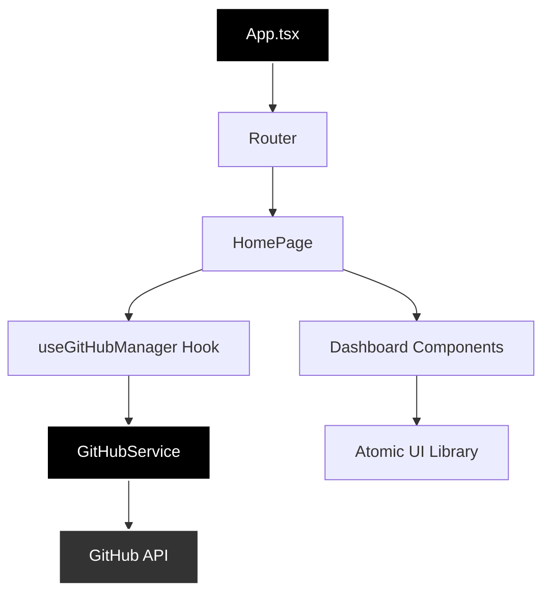

#  GitHub Follow Manager

<div align="center">
  <p><strong>Auditing connections. Purifying networks. Professional-grade social management.</strong></p>
  
  [](https://reactjs.org/)
  [](https://www.typescriptlang.org/)
  [](https://vitejs.dev/)
  [](LICENSE)
</div>

---

## 🎭 The Vision

Social connections on GitHub are more than just numbers—they are a developer's professional graph. **GitHub Follow Manager** was born from a need for a tool that respects that graph. No bloated features, no dark patterns, and absolutely **no data harvesting**.

This is a premium, monochrome dashboard designed for developers who value their social presence as much as their code quality.

## 💎 Crafted Features

- ⚡ **Atomic Performance**: Engineered with Vite 7 and React 19 for a dashboard that feels instant and alive.
- 🛡️ **Zero-Target Privacy**: Your data belongs to you. Every analysis, every token, and every interaction stays 100% local in your browser.
- 🎨 **Executive Aesthetic**: A world-class monochrome design system built with custom CSS and Framer Motion for high-fidelity interactions.
- 📦 **Bulk Orchestration**: Effortlessly unfollow non-mutuals or follow back your fans with real-time status orchestration.
- 🌡️ **Rate-Limit Intelligence**: Reactive monitoring that visualizes your GitHub API consumption in real-time.

## 🛠️ The Stack

- **Framework**: [React 19](https://react.dev/)
- **Runtime**: [Vite 7](https://vitejs.dev/)
- **Logic**: TypeScript + Axios
- **Motion**: [Framer Motion](https://www.framer.com/motion/)
- **Icons**: [Lucide React](https://lucide.dev/)
- **Styling**: Pure CSS Design System

## 🚀 Deployment

### Local Development

Enter the ecosystem in seconds:

```bash
# 1. Clone the repository
git clone https://github.com/ArshVermaGit/github-nonfollowers-cleaner.git

# 2. Access the directory
cd github-nonfollowers-cleaner

# 3. Install the environment
npm install

# 4. Launch the dashboard
npm run dev
```

### Authorization

To interact with your graph, you'll need a [Personal Access Token (Classic)](https://github.com/settings/tokens).
Required scopes: `read:user`, `user:follow`.

## 🏗️ Architecture

A clean, modular engine powering the experience:



## 🤝 Join the Evolution

I built this as a professional tool for the community. If you find a bug or have a vision for a new feature, your contributions are welcome.

1. Fork the project.
2. Create your feature branch (`git checkout -b feature/AmazingFeature`).
3. Commit your changes (`git commit -m 'Add some AmazingFeature'`).
4. Push to the branch (`git push origin feature/AmazingFeature`).
5. Open a Pull Request.

---

<div align="center">
  <p>Built with ❤️ by <strong>Arsh Verma</strong></p>
  <p>
    <a href="https://github.com/ArshVermaGit">GitHub</a> • 
    <a href="https://www.linkedin.com/in/arshvermadev/">LinkedIn</a> • 
    <a href="https://x.com/TheArshVerma">X</a>
  </p>
</div>
