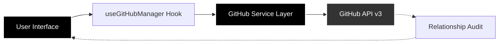

#  GitHub Follow Manager

<div align="center">
  <p><strong>Refining the social graph of the world's developers.</strong></p>
  <p><em>A premium, privacy-first orchestration dashboard for the modern engineer.</em></p>
  
  [](https://reactjs.org/)
  [](https://www.typescriptlang.org/)
  [](https://vitejs.dev/)
  [](https://github.com/ArshVermaGit/github-nonfollowers-cleaner)
</div>

---

## 🏛️ Executive Summary

**GitHub Follow Manager** is a high-performance, minimalist dashboard engineered to give developers absolute control over their professional network. Built on the principle of **Zero-Harvest Privacy**, the application performs complex relationship audits 100% within the client runtime, ensuring your security credentials never leave your machine.

## 🎭 The Philosophy

In an era of data-hungry tools, we chose a different path.

- **Privacy as a Feature**: Your Personal Access Token stays in your storage. We have no backend, no database, and no telemetry.
- **Minimalist Excellence**: A monochrome design system that focuses on utility and speed, removing the "noise" of traditional social tools.
- **Technical Transparency**: The entire stack is open-source and human-readable.

## 💎 Engineered Features

- ⚡ **Turbocharged Audit**: Leveraging Vite 7's build-time optimizations and React 19's concurrent rendering for near-instant profile analysis.
- 🛡️ **Vault Security**: Direct-to-API communication. Your GitHub tokens are managed entirely within your browser's secure context.
- 🎨 **Sovereign UI**: A bespoke, monochrome design language with fluid micro-interactions powered by Framer Motion.
- 📦 **Orchestrated Actions**: Intelligent bulk processing that respects the GitHub social graph while providing real-time feedback.
- 🚦 **Reactive Monitoring**: A live visualizer for GitHub's REST API rate limits, ensuring you stay within protocol boundaries.

## 🛠️ Technical Specifications

| Layer        | Technology                | Rationale                            |
| :----------- | :------------------------ | :----------------------------------- |
| **Runtime**  | React 19 + Vite 7         | State-of-the-art performance & DX    |
| **Language** | TypeScript                | Type-safe social graph manipulation  |
| **Logic**    | Axios + Custom Hooks      | Clean, modular API orchestration     |
| **Motion**   | Framer Motion             | High-fidelity UI state transitions   |
| **Styling**  | Vanilla CSS Design System | Zero-runtime overhead, total control |

## 🚀 Environment Setup

### Local Deployment

Launch your personal command center in sixty seconds:

```bash
# Clone the professional graph
git clone https://github.com/ArshVermaGit/github-nonfollowers-cleaner.git

# Enter the ecosystem
cd github-nonfollowers-cleaner

# Build the dependency tree
npm install

# Initialize the development runtime
npm run dev
```

### Protocol Authorization

Interact with the GitHub API securely:

1. Generate a [Personal Access Token (Classic)](https://github.com/settings/tokens).
2. Required Scopes: `read:user` (identity) & `user:follow` (orchestration).

## 🏗️ Architectural Blueprint

A modular, unidirectional data flow designed for scalability:



## 🗺️ Future Roadmap

- [ ] **Data Visualization**: Interactive D3.js charts for network growth analysis.
- [ ] **Collaborative Audit**: Export relationship reports in JSON/CSV.
- [ ] **Dark/Light Mode Sync**: System-level appearance orchestration.

## 🤝 Contribution Guidelines

I am building a community of developers who value clean code and social privacy.

1. **Focus**: Maintain the monochrome aesthetic.
2. **Quality**: Ensure 100% TypeScript coverage.
3. **Privacy**: Never introduce third-party analytics.

---

<div align="center">
  <p>Architected with ❤️ by <strong>Arsh Verma</strong></p>
  <p>
    <a href="https://github.com/ArshVermaGit">GitHub</a> • 
    <a href="https://www.linkedin.com/in/arshvermadev/">LinkedIn</a> • 
    <a href="https://x.com/TheArshVerma">X</a>
  </p>
</div>
